# チュートリアル： 迷路生成プログラム

<br>

## 本チュートリアルの説明

本チュートリアルは、自動で迷路を生成するプログラムを生成する過程を説明します。
使用する言語は**JavaScript**です。迷路生成プログラムでは、再帰関数やクラス構文を実装します。
これらに馴染みがない人でも、手を動かしながら実装することですこしでも学びが得られることを目的としています。

このチュートリアルは下記のセクションに分かれています。

1. 迷路の表示： JavaScript で生成した迷路情報を HTML と CSS で表示させます。
2. 迷路の自動生成： 迷路構造を自動生成するプログラムを実装します。
3. 迷路の自動探索： 迷路の正解ルートを自動探索するプログラムを実装します。

### これから作る成果物

このチュートリアルでは、迷路を自動生成します。
迷路はプログラムを実行するたびに自動生成され、ただ１つの正解ルートをもちます。
迷路の生成と探索にはアルゴリズムを利用しますが、事前の知識は必要ありません。

[**最終的な成果物を確認する**](http://grayhorse5.sakura.ne.jp/generate-maze/)

<p align="center">
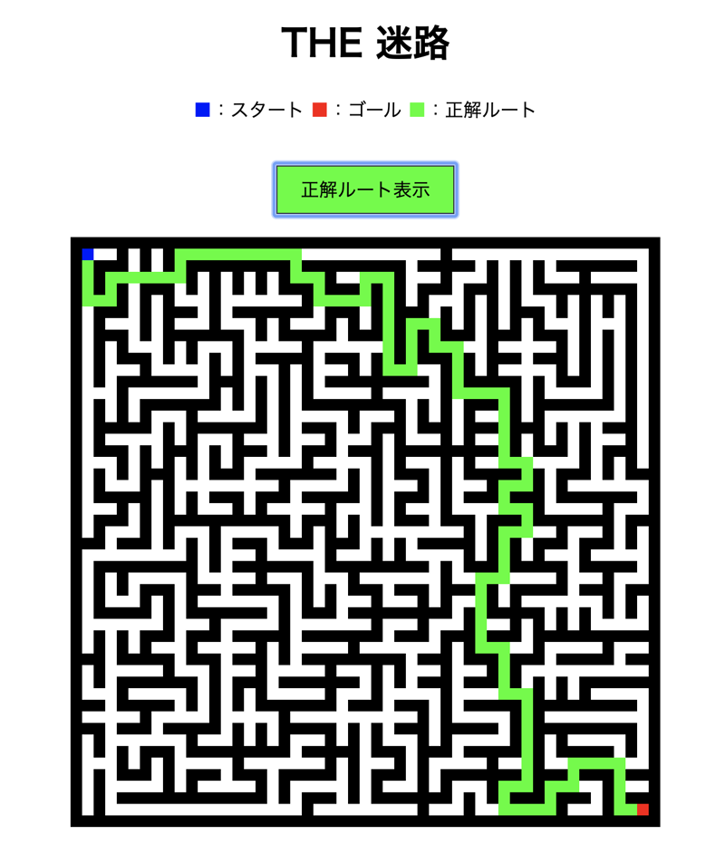
</p>

### 前提知識

HTML, CSS, JavaScript, jQuery を扱うのに慣れていることを想定しています。
関数、オブジェクト、配列、クラスの概念について詳しい説明はしません。
サンプルコードの記述に関しては、一部解説をしています。
このチュートリアルでは、
[アロー関数](https://developer.mozilla.org/ja/docs/Web/JavaScript/Reference/Functions/Arrow_functions)、
[クラス](https://developer.mozilla.org/ja/docs/Web/JavaScript/Reference/Classes)、
[import](https://developer.mozilla.org/ja/docs/Web/JavaScript/Reference/Statements/import)、
[export](https://developer.mozilla.org/ja/docs/Web/JavaScript/Reference/Statements/export)、
[分割代入](https://developer.mozilla.org/ja/docs/Web/JavaScript/Reference/Operators/Destructuring_assignment)を使用しています。

### チュートリアルの準備

このチュートリアルを進めるにあたって、下記のいずれかの方法で開発環境を準備します。

#### ブラウザでコードを書く

[CodePen](https://codepen.io/)を利用することで、ブラウザでコードを書くことができます。
注意事項として、外部ファイルの読み込みをするので、そのための設定が必要です。
[こちら](https://blog.codepen.io/2017/12/26/adding-typemodule-scripts-pens/)に設定の例が記載してあります。

#### ローカル開発環境でコードを書く

好きなテキストエディタでコードを書きます。
注意事項として、外部ファイルの読み込みをするので、そのための設定が必要です。
今回は、簡易ローカルサーバを立てることができる拡張機能を導入します。
そうしなければ、CORS により外部ファイルが読み込めないためです。
例えば、テキストエディタに
[VSCode](https://azure.microsoft.com/ja-jp/products/visual-studio-code/)を利用する場合、
[Live Sever](https://marketplace.visualstudio.com/items?itemName=ritwickdey.LiveServer)をインストールします。

<br>

## 迷路の表示

まずは、迷路を表示させるために HTML と CSS ファイルを用意しましょう。
用意するファイルは２つあります。
**_index.html_** と **_style.css_** です。
今回は、Table タグを装飾することで迷路を表現しています。

**_index.html_**

```javascript
<!DOCTYPE html>
  <body>
    <link rel="stylesheet" href="style.css">
    <table class="maze">
      <tbody>
        <tr>
          <td class="maze-cell -wall"></td>
          <td class="maze-cell -wall"></td>
          <td class="maze-cell -wall"></td>
          <td class="maze-cell -wall"></td>
          <td class="maze-cell -wall"></td>
        </tr>
        <tr>
          <td class="maze-cell -wall"></td>
          <td class="maze-cell -start"></td>
          <td class="maze-cell -path"></td>
          <td class="maze-cell -path"></td>
          <td class="maze-cell -wall"></td>
        </tr>
        <tr>
          <td class="maze-cell -wall"></td>
          <td class="maze-cell -wall"></td>
          <td class="maze-cell -wall"></td>
          <td class="maze-cell -path"></td>
          <td class="maze-cell -wall"></td>
        </tr>
        <tr>
          <td class="maze-cell -wall"></td>
          <td class="maze-cell -path"></td>
          <td class="maze-cell -path"></td>
          <td class="maze-cell -goal"></td>
          <td class="maze-cell -wall"></td>
        </tr>
        <tr>
          <td class="maze-cell -wall"></td>
          <td class="maze-cell -wall"></td>
          <td class="maze-cell -wall"></td>
          <td class="maze-cell -wall"></td>
          <td class="maze-cell -wall"></td>
        </tr>
      </tbody>
    </table>
  </body>
</html>
```

<br>

**_style.css_**

```css
*,
*::before,
*::after {
  box-sizing: border-box;
}

.maze {
  border-collapse: collapse;
  margin: 20px auto 0;
}

.maze-cell {
  width: 20px;
  height: 20px;
  padding: 0;
  border: 1px solid #ddd;
}

.maze-cell.-wall {
  background-color: #000;
}

.maze-cell.-path {
  background-color: #fff;
}

.maze-cell.-start {
  background-color: #00f;
}

.maze-cell.-goal {
  background-color: #f00;
}
```

class の説明

- maze-cell: 迷路のセルを表す。通路や壁にも当てはまる共通クラス。
- -wall: 迷路の壁を表す。黒色。
- -path: 迷路の通路を表す。白色。
- -start: 迷路のスタートを表す。青色。
- -goal: 迷路のゴールを表す。赤色。

<p align="center">

</p>

このように、セル（行と列の交わる箇所）を壁や通路として定義し、定義に応じた装飾をすることで迷路を表を用いて表現することができます。

### JavaScript で迷路を生成する

HTML と CSS で迷路を表示することができました。
しかし、このままでは動的に生成した迷路を表示させることができません。
ここからは動的に生成する迷路を表示するプログラムを書いていきましょう。

まずは、 **_index.html_** を下記のように修正しましょう。
クラス名"maze-wrapper"の div 要素の中身は空っぽです。
この中身をプログラムで生成していきます。
CSS だけでなく、jQuery と **_main.js_** を読み込んでいることにも注意してください。

**_index.html_**

```html
<!DOCTYPE html>
  <link rel="stylesheet" href="style.css">
  <body>
    <div class="maze-wrapper"></div>

    <script src="https://cdnjs.cloudflare.com/ajax/libs/jquery/3.4.1/jquery.min.js"></script>
    <script src="main.js" type="module"></script>
  </body>
</html>
```

これから、JavaScript で迷路の中身を実装していきましょう。
用意する JavaScript のファイルは２つあります。
**_main.js_** と **_Maze.js_** です。

**_main.js_**

```javascript
import { Maze } from './Maze.js';

const WIDTH = 9;
const HEIGHT = 9;
const maze = new Maze(WIDTH, HEIGHT);
```

**_Maze.js_**

```javascript
export class Maze {
  constructor(WIDTH, HEIGHT) {
    this.WIDTH = WIDTH;
    this.HEIGHT = HEIGHT;
    this.grid = []; // cellTypeを格納した二次元配列
    this.startCellList = []; // 壁を生成するスタート地点となるセルの候補を格納した二次元配列
    this.start = []; // スタート地点の[row, column]
    this.goal = []; // ゴール地点の[row, column]
    this.cellType = {
      Start: 'S',
      Goal: 'G',
      Path: 0,
      Wall: 1,
      ExtendingWall: 2,
      ExtendingStart: 3
    };
    this.extendingCounter = 0; // 迷路の壁を拡張するたびにカウンターが増加する
  }
}
```

２つのファイルの説明

- **_main.js_**: メインのロジックを実装。 **_Maze.js_** で定義したクラスを操作する。
- **_Maze.js_**: 迷路のクラス(Maze クラス)を定義する。

Maze クラスでは、コンストラクタを定義します。
迷路が持つ情報は、全てコンストラクタの中にプロパティとして追加します。
**_main.js_** は、 **_Maze.js_** で定義したクラスを呼び出して使えるようにしています。

```javascript
// モジュールからエクスポートをひとつインポートする
import { Maze } from './Maze.js';

// 個々の機能のエクスポート
export class Maze {...}
```

よって、Maze クラスのインスタンスを生成することが可能です。

```javascript
const maze = new Maze(WIDTH, HEIGHT);
```

### 迷路を二次元配列で表現する

Maze クラスでは、迷路の構造に関する情報を定義します。
オセロや将棋盤のような盤面を表現するのには、二次元配列が便利です。
今回は、下記のように行(Row)と列(Column)で座標を表すように定義します。

<p align="center">
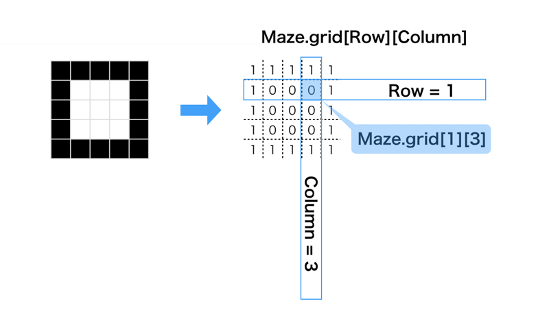
</p>

二次元配列で指定したセルの値は、cellType で用意している状態を表します。
壁にしたいセルの値は 1 で、ゴールにしたいセルの値は"G"です。

<p align="center">
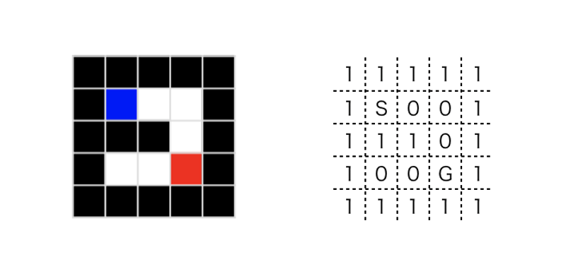
</p>

### `👍gridのタイプをリスト形式で定義する`

ここでポイント 👍 を紹介します。
下記のように、grid の中に格納するセルのタイプをリスト形式で定義しておきましょう。
理由は、意味のない文字や数字を記述するとコードの可読性が低くなるからです。
少なくとも、人間が目で見て管理する範囲に関しては、人間が理解しやすいような表記を意識してコードを記述します。

```javascript
this.cellType = {
  Start: 'S',
  Goal: 'G',
  Path: 0,
  Wall: 1,
  ExtendingWall: 2,
  ExtendingStart: 3
};
```

cellType の説明

- ExtendingWall: 拡張中の壁であることを表す。
- ExtendingStart: 壁を拡張する時の拡張開始位置候補であることを表す。

例として、リスト形式で表示しない場合のプログラムの一部を示します。

```javascript
// 指定セルがWallではないなら、ExtendingWallに状態を変更する
if (this.grid[row][column] !== 1) {
  this.grid[row][column] = 2;
  isExtendingSuccess = this.extendWall(row, column);
}
```

次に、リスト形式で表示した場合のプログラムの一部です。

```javascript
// 指定セルがWallではないなら、ExtendingWallに状態を変更する
if (this.grid[row][column] !== this.cellType.Wall) {
  this.grid[row][column] = this.cellType.ExtendingWall;
}
```

上記の２つは、内部的には同じ処理をしています。
ただ、上記のプログラムは、コードを読む前に 1 が壁を表すことや、2 が拡張中の壁であることを表すことが頭にないと、読んだときに理解することができません。
プログラムを読むときに頭に入れておかなければいけない情報はなるべく少なくした方が、読む人にとっての負担が少ないと言えます。
もちろん、全ての場合に当てはまる書き方ではないので、場合によって使い分けましょう。

### 迷路の初期状態を作って表示する

では、早速迷路の初期状態を生成してみましょう。初期状態は、大枠の壁以外が全て通路になるように grid を生成します。
grid を生成するサンプルコードを見てみましょう。generateGrid()と initializeCellType()という２つのクラスメソッドを追加します。
このメソッドでは、grid の二次元配列を生成する過程で、条件式の判定に応じたセルに壁や道の値を代入しています。

**_Maze.js_**

```javascript
// HEIGHT行,WIDTH列の行列を生成
  generateGrid() {
    for (let row = 0; row < this.HEIGHT; row++) {
      let rowList = [];
      for (let column = 0; column < this.WIDTH; column++) {
        rowList.push(this.initializeCellType(row, column));
      }
      this.grid.push(rowList);
    }
  }

  // rowとcolumの値に応じたcellTypeの初期化を実施
  // 大外は壁に設定
  initializeCellType(row, column) {
    if (row === 0 || row === this.HEIGHT - 1) {
      return this.cellType.Wall;
    } else {
      if (column === 0 || column === this.WIDTH - 1) {
        return this.cellType.Wall;
      } else {
        return this.cellType.Path;
      }
    }
  }
```

次に、grid の情報を元に DOM を生成するコードを用意しましょう。

**_Maze.js_**

```javascript
// インスタンスのデータを元に、DOMを生成
drowMyself() {
  ++this.extendingCounter;
  let className = `maze step${this.extendingCounter}`;
  $('.maze-wrapper').append(
    $(`<table class="${className}"><caption>${className}</caption>`).append(
      $('<tbody>')
    )
  );

  for (let row = 0; row < this.HEIGHT; row++) {
    let tr = $('<tr>');
    for (let column = 0; column < this.WIDTH; column++) {
      if (this.grid[row][column] === this.cellType.Wall) {
        tr.append($('<td class="maze-cell -wall"></td>'));
      } else if (this.grid[row][column] === this.cellType.ExtendingWall) {
        tr.append($('<td class="maze-cell -extending-wall"></td>'));
      } else if (this.grid[row][column] === this.cellType.ExtendingStart) {
        tr.append($('<td class="maze-cell -extending-start"></td>'));
      } else if (this.grid[row][column] === this.cellType.Start) {
        tr.append($('<td class="maze-cell -start"></td>'));
      } else if (this.grid[row][column] === this.cellType.Goal) {
        tr.append($('<td class="maze-cell -goal"></td>'));
      } else {
        tr.append($('<td class="maze-cell -path"></td>'));
      }
    }

    $(`.maze.step${this.extendingCounter} tbody`).append(tr);
  }
}
```

**_Maze.js_** で定義したインスタンスメソッドは、 **_main.js_** で実行します。

**_main.js_**

```javascript
maze.generateGrid();
maze.drowMyself();
```

ブラウザで確認すると、大外が壁になった迷路が描画できているはずです。

<p align="center">
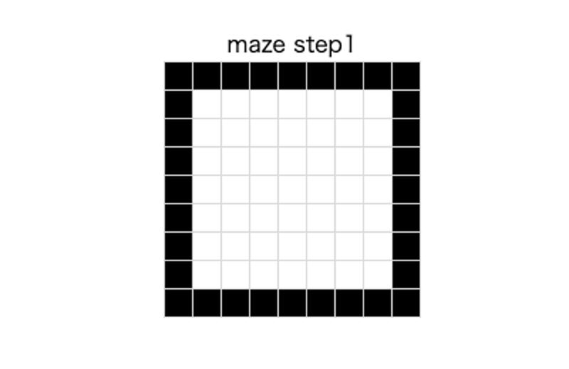
</p>

コンソールに迷路インスタンスの情報を出力してみましょう。

**_main.js_**

```javascript
console.log(maze);
```

maze.grid で参照可能な二次元配列の迷路構造が、描画した迷路構造と同じであることが確認できますね。

<p align="center">
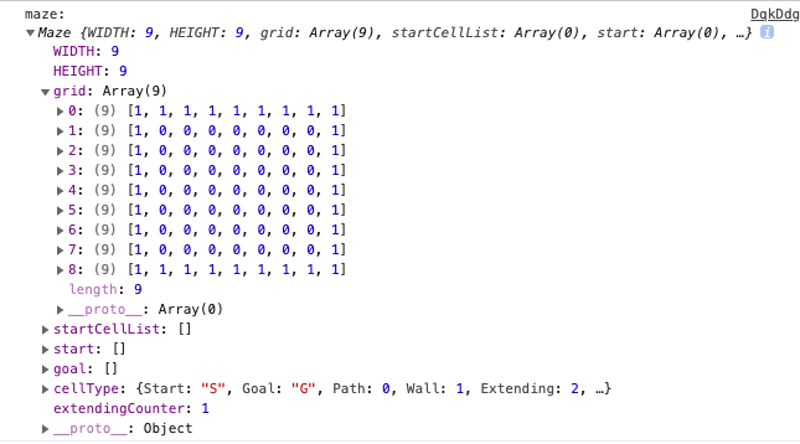
</p>

これまでの手順で、二次元配列で迷路を表現できるということがわかりました。
迷路生成プログラムの流れを整理してみましょう。

- 迷路クラスで定義した、迷路インスタンスを生成
- 迷路インスタンスのプロパティとして、迷路構造を表す二次元配列を生成
- 迷路インスタンスのメソッドを実行して、プロパティを更新
- 迷路インスタンスの情報を元に迷路を表示

迷路を生成するには、迷路クラスで定義したインスタンスメソッドを実行して、迷路インスタンスのプロパティを更新していきます。
次は、迷路を自動で生成するメソッドを実装していきましょう。

[この時点でのコードを確認する](https://codepen.io/matsuhaya/pen/RwPGPXG)

**_Maze.js_** は[こちら](https://codepen.io/matsuhaya/pen/gOpwmQJ)

<br>

## 迷路の自動生成

ここまでの実装で、迷路の初期状態を生成することができました。
次に、迷路の自動生成を実装していきましょう。
迷路インスタンスのメソッドを実行して、プロパティを更新していきます。

迷路を自動で生成するアルゴリズムはいくつかあるようなのですが、今回は「壁伸ばし法」を採用します。
壁伸ばし法で壁を拡張する処理のフローは、下記の通りです。

### `🧩アルゴリズム： 壁伸ばし法`

**迷路生成のフロー**

1. row, column がともに偶数となるセルを、壁伸ばし開始地点(候補)としてリストに追加
2. ランダムでリストからセルを選び、壁かどうかを確認
   - 壁でない場合、**3 の処理へ**
   - 壁の場合、**5 の処理へ**
3. 選んだセルを拡張中の壁に更新
4. **壁の拡張**を実行
   - 成功した場合、**5 の処理へ**
   - 失敗した場合、**7 の処理へ**
5. 拡張中の壁を壁に更新
6. 選んだセルはリストから削除して、**8 の処理へ**
7. 拡張中の壁を元に戻して、**2 の処理へ**
8. リストが空かどうかを確認
   - 空ではない場合、**2 の処理へ**
   - 空の場合、**処理を終了**

<p align="center">
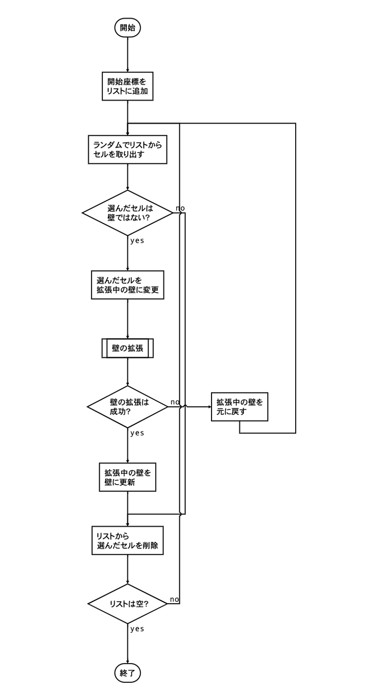
</p>

**壁の拡張のフロー**

1. 現在のセルから、4 方向全てについて壁を伸ばせるかどうか確認
   - 壁を伸ばせる方向がある場合、**2 の処理へ**
   - 壁を伸ばせる方向がなければ、**壁伸ばし失敗をリターン**
2. 壁を伸ばせる方向を全てリストに追加
3. ランダムでリストから壁を伸ばす方向を選ぶ
4. 2 セル先までを拡張中の壁に更新
5. 2 セル先が壁かどうかを確認
   - 壁と接続していない場合、**1 の処理へ**
   - 壁と接続した場合、**6 の処理へ**
6. 拡張中の壁を、壁に更新
7. **壁伸ばし成功をリターン**

<p align="center">
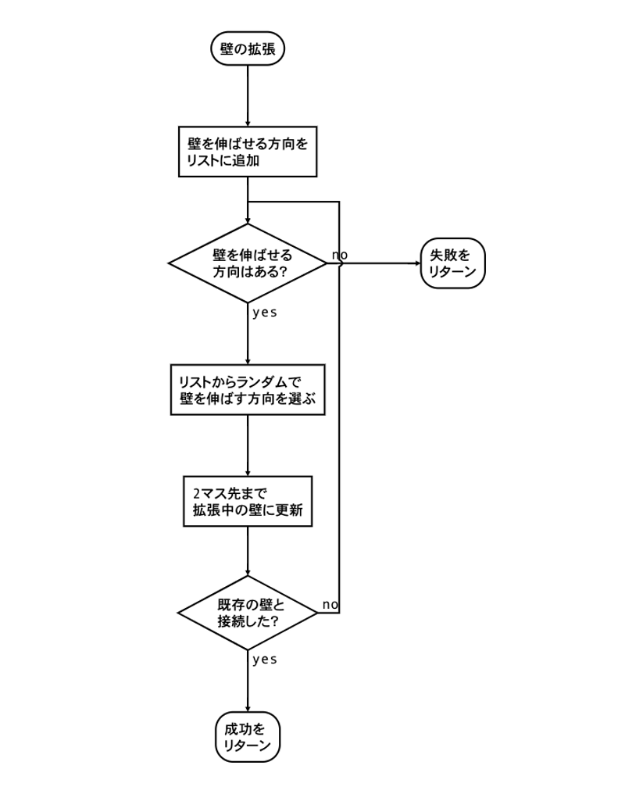
</p>

### フローをコードで書く

壁を拡張する処理をフローで表したので、実際にコードを書いていきましょう。
まずは、迷路生成のフローを書いていきます。

**_Maze.js_**

```javascript
generateMaze() {
  this.addStartCellList();

  while (this.startCellList.length) {
    let { randIndex, startRow, startColumn } = this.getStartCell();
    let isExtendingSuccess = false;

    if (this.grid[startRow][startColumn] === this.cellType.ExtendingStart) {
      this.grid[startRow][startColumn] = this.cellType.ExtendingWall;
      isExtendingSuccess = this.extendWall(startRow, startColumn);

      if (isExtendingSuccess) {
        this.updateExtendingWall(this.cellType.Wall);
        this.removeStartCellList(randIndex);
      } else {
        this.updateExtendingWall(this.cellType.Path);
      }
    } else {
      this.removeStartCellList(randIndex);
    }
  }
}
```

<hr>

generateMaze の最初の処理は、壁を生成するスタート地点となるセルの候補を列挙することです。
addStartCellList()は、row, column ともに偶数となるセルを壁伸ばし開始地点(候補)としてリストに格納するメソッドです。

**_Maze.js_**

```javascript
addStartCellList() {
  for (let row = 1; row < this.HEIGHT - 1; row++) {
    for (let column = 1; column < this.WIDTH - 1; column++) {
      if (row % 2 === 0 && column % 2 === 0) {
        this.startCellList.push([row, column]);
        this.grid[row][column] = this.cellType.ExtendingStart;
      }
    }
  }
}
```

9 マス四方の場合、壁を生成するスタート地点の候補は下記の通りになります。

<p align="center">
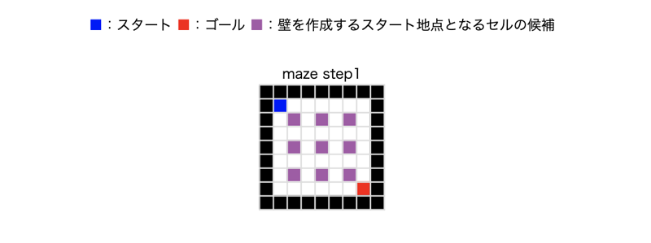
</p>

迷路の自動生成では、壁の拡張を迷路が完成するまで繰り返し実行します。
壁伸ばし開始地点(紫のセル)が全て壁に置き換わった時点で、迷路の生成は完了です。

<hr>

removeStartCellList()は、壁の拡張が終わったらリストから壁を生成するスタート地点となったセルを削除します。

**_Maze.js_**

```javascript
removeStartCellList(index) {
    this.startCellList.splice(index, 1);
}
```

<hr>

removeStartCellList()は、壁の拡張が終わったら迷路の情報を更新する関数です。
extendWall を実行中、拡張中の壁だけが ExtendingWall となるようにします。
更新後の迷路は、cellType が Path と Wall のみになっているはずです。

**_Maze.js_**

```javascript
updateExtendingWall(nextCellType) {
  for (let row = 0; row < this.HEIGHT; row++) {
    for (let column = 0; column < this.WIDTH; column++) {
      if (this.grid[row][column] === this.cellType.ExtendingWall) {
        this.grid[row][column] = nextCellType;

        if (
          nextCellType === this.cellType.Path &&
          row % 2 === 0 &&
          column % 2 === 0
        ) {
          this.grid[row][column] = this.cellType.ExtendingStart;
        }
      }
    }
  }
}
```

<hr>

次は、ランダムでリストからセルを選び、壁かどうかを確認しましょう。
[分割代入](https://developer.mozilla.org/ja/docs/Web/JavaScript/Reference/Operators/Destructuring_assignment)で代入したのは、addStartCellList の内ランダムに選んだインデックスと、セルの行列です。
インデックスは、後の処理でリストから選んだセルを削除するために使います。
また、行と列はセルの位置を示す情報ですので、壁の拡張をしながら更新していく値です。

```javascript
let { randIndex, startRow, startColumn } = this.getStartCell();
```

**_Maze.js_**

```javascript
getStartCell() {
  let nextRandIndex = Math.floor(Math.random() * this.startCellList.length);
  let nextStartRow = this.startCellList[nextRandIndex][0];
  let nextStartColumn = this.startCellList[nextRandIndex][1];
  return {
    randIndex: nextRandIndex,
    startRow: nextStartRow,
    startColumn: nextStartColumn
  };
}
```

壁伸ばし開始地点を選んだら、壁の拡張を実行します。

```javascript
isExtendingSuccess = this.extendWall(startRow, startColumn);
```

ここで、壁を拡張するプロセスを確認しましょう。

<p align="center">
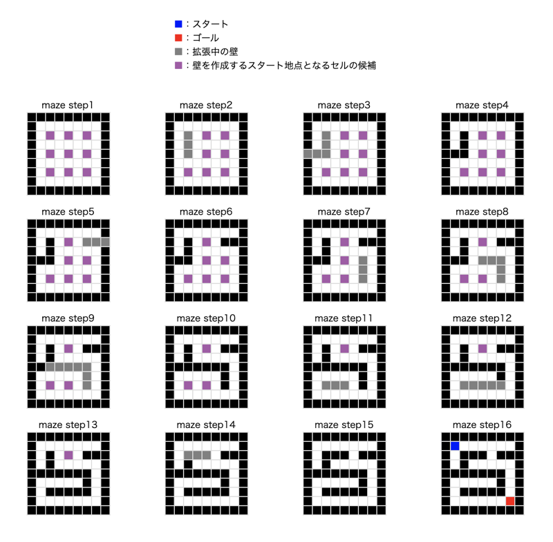
</p>

ランダムに選ばれた紫のセルから壁が伸びていく様子がわかります。
そして、拡張中の壁は既存の壁にぶつかった時点で壁に更新します。
この壁の拡張は、終了条件を満たすまで繰り返し実行します。
最終的に、最初にリストアップした紫のセルが、全て黒の壁に置き換わっていることが確認できますね。

では、壁の拡張をする関数を書きましょう。

**_Maze.js_**

```javascript
extendWall(row, column) {
  const DISTANCE = 2; // 進行距離
  let isConnectedWall = false;
  let clearDirectionList = this.addClearDirectionList(row, column, DISTANCE);

  if (clearDirectionList.length) {
    let rand = Math.floor(Math.random() * clearDirectionList.length);
    ({ row, column, isConnectedWall } = this.updateExtendingWallOnDirection(
      row,
      column,
      clearDirectionList[rand],
      DISTANCE
    ));
    //迷路の生成過程を描画する
    this.drowMyself();

    if (!isConnectedWall) {
      return this.extendWall(row, column);
    } else {
      console.log('壁伸ばし成功');
      return true;
    }
  } else {
    console.log('壁伸ばし失敗');
    return false;
  }
}
```

まずは、現在のセルから、4 方向全てについて壁を伸ばせるかどうか確認します。

**_Maze.js_**

```javascript
addClearDirectionList(row, column, DISTANCE) {
  const clearDirectionList = [];
  // 上方向
  if (this.grid[row - DISTANCE][column] !== this.cellType.ExtendingWall) {
    clearDirectionList.push('UP');
  }
  // 下方向
  if (this.grid[row + DISTANCE][column] !== this.cellType.ExtendingWall) {
    clearDirectionList.push('DOWN');
  }
  // 左方向
  if (this.grid[row][column - DISTANCE] !== this.cellType.ExtendingWall) {
    clearDirectionList.push('LEFT');
  }
  // 右方向
  if (this.grid[row][column + DISTANCE] !== this.cellType.ExtendingWall) {
    clearDirectionList.push('RIGHT');
  }
  return clearDirectionList;
}
```

壁を伸ばせる方向のみ、clearDirectionList に追加します。

<p align="center">
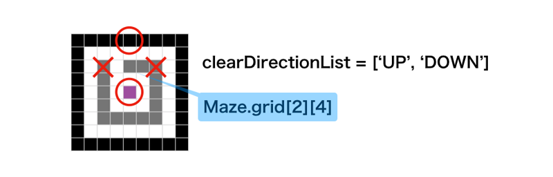
</p>

今度は宣言のない[分割代入](https://developer.mozilla.org/ja/docs/Web/JavaScript/Reference/Operators/Destructuring_assignment)で、clearDirectionList の内ランダムに選んだ方向に 2 セル進んだ先のセルの行列と、壁と接続したかの判定結果を代入します。

```javascript
({ row, column, isConnectedWall } = this.updateExtendingWallOnDirection(
  row,
  column,
  clearDirectionList[randIndex],
  DISTANCE
));
```

**_Maze.js_**

```javascript
updateExtendingWallOnDirection(row, column, direction, DISTANCE) {
  let isConnectedWall;

  switch (direction) {
    case 'UP':
      isConnectedWall =
        this.grid[row - DISTANCE][column] === this.cellType.Wall;
      for (let i = 0; i < DISTANCE; i++) {
        this.grid[--row][column] = this.cellType.ExtendingWall;
      }
      break;
    case 'DOWN':
      isConnectedWall =
        this.grid[row + DISTANCE][column] === this.cellType.Wall;
      for (let i = 0; i < DISTANCE; i++) {
        this.grid[++row][column] = this.cellType.ExtendingWall;
      }
      break;
    case 'LEFT':
      isConnectedWall =
        this.grid[row][column - DISTANCE] === this.cellType.Wall;
      for (let i = 0; i < DISTANCE; i++) {
        this.grid[row][--column] = this.cellType.ExtendingWall;
      }
      break;
    case 'RIGHT':
      isConnectedWall =
        this.grid[row][column + DISTANCE] === this.cellType.Wall;
      for (let i = 0; i < DISTANCE; i++) {
        this.grid[row][++column] = this.cellType.ExtendingWall;
      }
      break;
  }
  return {
    row: row,
    column: column,
    isConnectedWall: isConnectedWall
  };
}
```

### 再帰関数の実行

ここで、再度 extendWall の処理を確認します。
下記の擬似コードの通り、extendWall のフローでは壁の更新処理があります。
この更新結果に応じて、以降の処理が分岐していきます。
更新処理を終えても壁と接続していない場合、更新後の行列を引数に指定して再度 extendWall を実行します。

このように、自身の関数を呼び出す関数を再帰関数と呼びます。
今回の例では、毎回異なる引数(セルの行列)とその時点での迷路の状態における計算結果を繰り返し出力します。

```javascript
extendWall(row, column) {
  let isConnectedWall = false;

  if (clearDirectionList.length) {
    // ランダムな方向に壁を伸ばす処理を実行
    // rowとcolumは進んだ先のセルの行列に更新
    // 壁と接続したら、isConnectedWall = trueに更新

    if (!isConnectedWall) {
      return this.extendWall(row, column);
    } else {
      console.log('壁伸ばし成功');
      return true;
    }
  } else {
    console.log('壁伸ばし失敗');
    return false;
  }
}
```

自動迷路生成プログラムでは、毎回違った構造の迷路を出力します。
それは、以下の条件で再帰関数を実行しているからです。

- 壁を伸ばす方向が毎回ランダムである
- 迷路の状態が更新されるので実行時の状態が毎回異なる

<p align="center">

</p>

ここまで実装できたら、迷路の自動生成ができているはずです。
せっかくなので、スタート地点とゴール地点を設定するプログラムも用意しましょう。

**_Maze.js_**

```javascript
setUpperLeftStart() {
  let startRow = 1;
  let startColumn = 1;
  this.start = [startRow, startColumn];
  this.grid[startRow][startColumn] = this.cellType.Start;
}

setUnderRightGoal() {
  let goalRow = this.HEIGHT - 2;
  let goalColumn = this.WIDTH - 2;
  this.goal = [goalRow, goalColumn];
  this.grid[goalRow][goalColumn] = this.cellType.Goal;
}
```

これで、迷路クラスのメソッドを定義できました。
実行する前に、**_index.html_** と **_main.css_** を次の通りに修正しましょう。

**_index.html_**

```html
<!DOCTYPE html>
  <link rel="stylesheet" href="style.css">
  <body>
    <div class="description">
      <ul class="description__list">
        <li class="description__list-item">
          <span class="color-blue">■</span>：スタート
        </li>
        <li class="description__list-item">
          <span class="color-red">■</span>：ゴール
        </li>
        <li class="description__list-item">
          <span class="color-gray">■</span>：拡張中の壁
        </li>
        <li class="description__list-item">
          <span class="color-purple">■</span
          >：壁を作成するスタート地点となるセルの候補
        </li>
      </ul>
    </div>

    <div class="maze-wrapper"></div>

    <script src="https://cdnjs.cloudflare.com/ajax/libs/jquery/3.4.1/jquery.min.js"></script>
    <script src="main.js" type="module"></script>
  </body>
</html>
```

**_main.css_**

```css
*,
*::before,
*::after {
  box-sizing: border-box;
}

.description {
  margin: 16px auto;
  text-align: center;
  display: block;
}

.description__list {
  padding-left: 0;
  list-style: none;
  display: inline-block;
}

.description__list-item {
  text-align: left;
}

.color-blue {
  color: #00f;
}

.color-red {
  color: #f00;
}

.color-gray {
  color: #808080;
}

.color-purple {
  color: #a757a8;
}

.maze {
  border-collapse: collapse;
  margin: 20px auto 0;
}

.maze-cell {
  width: 20px;
  height: 20px;
  padding: 0;
  border: 1px solid #ddd;
}

.maze-cell.-wall {
  background-color: #000;
}

.maze-cell.-extending-wall {
  background-color: #808080;
}

.maze-cell.-extending-start {
  background-color: #a757a8;
}

.maze-cell.-path {
  background-color: #fff;
}

.maze-cell.-answer-route.show {
  background-color: #0f0;
}

.maze-cell.-start {
  background-color: #00f;
}

.maze-cell.-goal {
  background-color: #f00;
}

.maze-wrapper {
  margin: 20px auto 0;
  display: grid;
  grid-template-columns: 1fr 1fr 1fr 1fr;
}
```

それでは、 **_main.js_** で迷路インスタンスの generateMaze を実行してみましょう。

**_main.js_**

```javascript
import { Maze } from './Maze.js';

//サイズは必ず5以上の奇数で生成する
const WIDTH = 9;
const HEIGHT = 9;
const maze = new Maze(WIDTH, HEIGHT);
maze.generateGrid();
maze.generateMaze();
maze.setUpperLeftStart();
maze.setUnderRightGoal();
maze.drowMyself();
```

迷路の自動生成ができていれば、実行するごとに異なる迷路が表示されるはずです。

<p align="center">
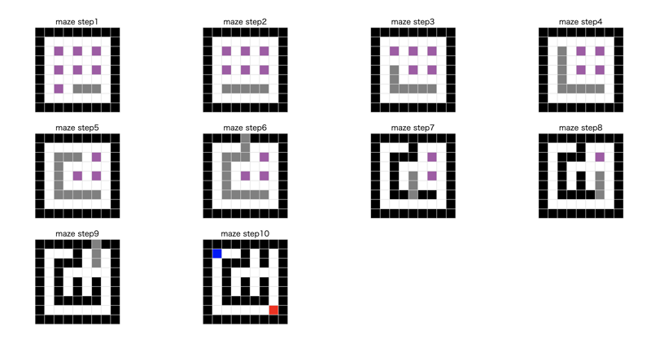
</p>

### `🚨既存の壁に到達しないパターン`

壁の拡張のフローを確認すると、

> 壁を伸ばせる方向がなければ、**壁伸ばし失敗をリターン**

とありますが、それはどのような時に起こりうるでしょうか。

<p align="center">
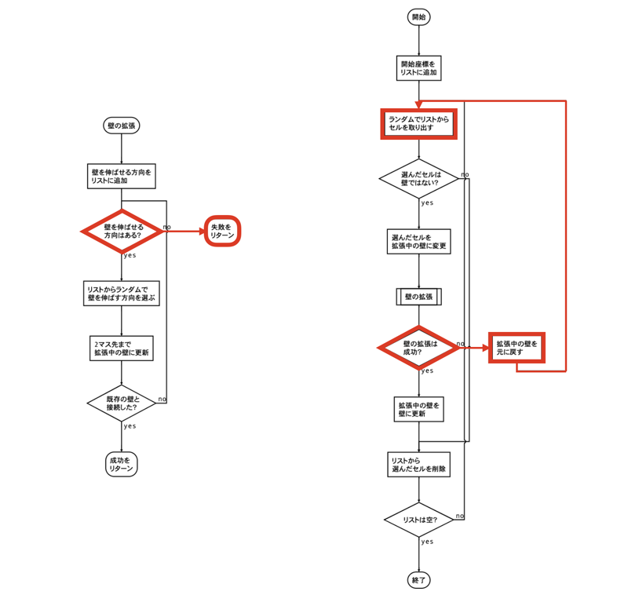
</p>

それは、**拡張中の壁に四方を囲まれてしまった場合**です。
このパターンに陥った場合は、拡張中の壁に関する変更を破棄して再度壁を作り直します。

<p align="center">
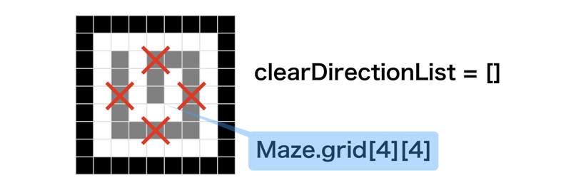
</p>

### `👍テストを書いて動作を確認する`

さて、これまでは実装した後にブラウザで動作を確認していましたね。
しかし、今回は壁伸ばしが本当に失敗した時にも正しく動作するのかを状況を再現して確認する必要があります。
理由は、ランダムで迷路を生成する過程で上記のパターンに陥る可能性が高くないからです。
9 マス四方の場合、四隅のスタート地点から時計回りと反時計回りに壁を生成したパターンが該当するので、4×2 の合計 8 パターンしかないのです。
そこで、壁を拡張している最中に拡張中の壁に囲まれた状態を再現するコードを書く必要があるという訳です。

今回は、テストを書くためのライブラリを使用せず、ブラウザの console 機能でテストを実行します。

**_Maze.js_**

```javascript
extendWall_ng_falseClearDirectionListAndFalseIsConnectedWall() {
  // 1.前提条件を満たす状態変更
  // this.grid(4,4)が拡張中の壁に囲まれる状態にする
  const DISTANCE = 2; // 進行距離
  let isConnectedWall = false;
  let row = 2;
  let column = 2;
  let extendingDirectionList = [
    'DOWN',
    'DOWN',
    'RIGHT',
    'RIGHT',
    'UP',
    'UP',
    'LEFT',
    'DOWN'
  ];
  this.grid[row][column] = this.cellType.ExtendingWall;

  for (let i = 0; i < extendingDirectionList.length; i++) {
    ({ row, column, isConnectedWall } = this.updateExtendingWallOnDirection(
      row,
      column,
      extendingDirectionList[i],
      DISTANCE
    ));
    this.drowMyself();
  }

  // 2.実行
  let result = this.extendWall(4, 4);

  // 3.結果表示
  // 壁拡張中、拡張中の壁に囲まれたらテスト成功をコンソールに出力
  if (!result) {
    console.log('テスト成功:', this.grid);
  } else {
    console.log('テスト失敗:', this.grid);
  }

  // 4.結果をリターン
  return result;
}
```

generateMaze でテストを実行してみましょう。

**_Maze.js_**

```javascript
generateMaze() {
  this.addStartCellList();

  while (this.startCellList.length) {
    let { randIndex, startRow, startColumn } = this.getStartCell();
    let isExtendingSuccess = false;

    if (this.grid[startRow][startColumn] === this.cellType.ExtendingStart) {
      // 一旦コメントアウト
      // this.grid[startRow][startColumn] = this.cellType.ExtendingWall;
      // isExtendingSuccess = this.extendWall(startRow, startColumn);

      // falseがリターンされるテスト
      isExtendingSuccess = this.extendWall_ng_falseClearDirectionListAndFalseIsConnectedWall();

      if (isExtendingSuccess) {
        this.updateExtendingWall(this.cellType.Wall);
        this.removeStartCellList(randIndex);
      } else {
        console.log('拡張中の壁を元にもどし、再度壁を拡張します');
        this.updateExtendingWall(this.cellType.Path);
        return; // テストを実行する時はreturnを記述してwhileループを抜ける
      }
    } else {
      this.removeStartCellList(randIndex);
    }
  }
}
```

実行後にブラウザの console を確認してみましょう。
想定通り、壁伸ばしが失敗して、テストが成功していることを確認できました。

<p align="center">
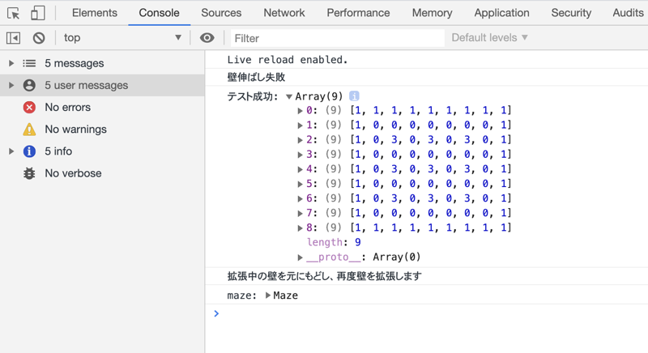
</p>

drowMyself で途中経過を描画すると、ブラウザで迷路の状態を確認できます。
これで、壁の拡張が失敗しても壁の拡張をやり直すことができるので、迷路が完成するまで処理が止まることがないですね。

<p align="center">
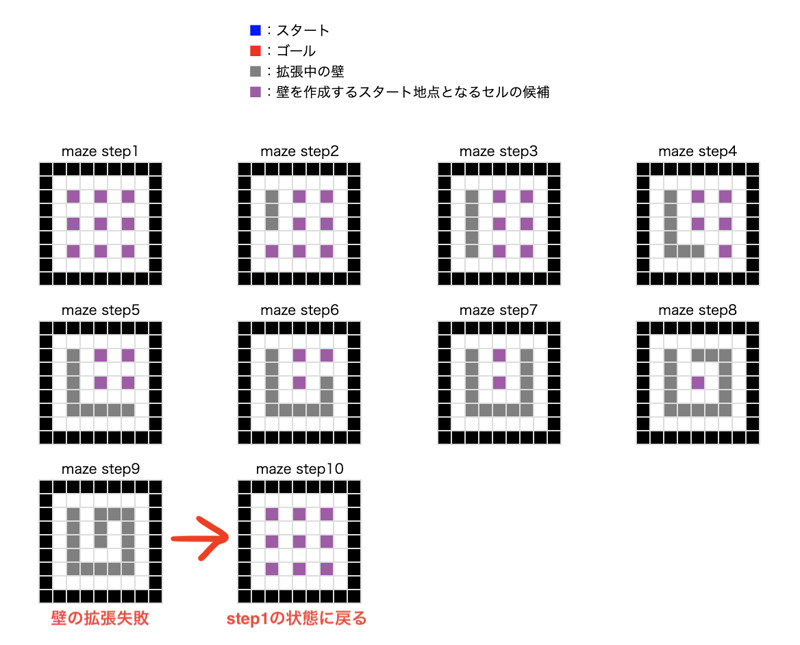
</p>

[この時点でのコードを確認する](https://codepen.io/matsuhaya/pen/GRJNwVM)

**_Maze.js_** は[こちら](https://codepen.io/matsuhaya/pen/ZEGBmgd)

<br>

## 迷路の自動探索

迷路の自動生成ができたので、次は正解ルートの自動探索を実装します。
正解ルートの探索のために、新たに **_Explorer.js_** を用意します。

**_Explorer.js_** は迷路探索のクラス(Explorer クラス)を定義するファイルです。
役割は、迷路構造を元に正解ルートを探索して、正解ルートの情報を迷路情報に更新することです。
Explorer は、Maze の地図を見ながら正解ルートを探索し、ゴールに到達したらその道を Maze に報告するというイメージです。

<p align="center">
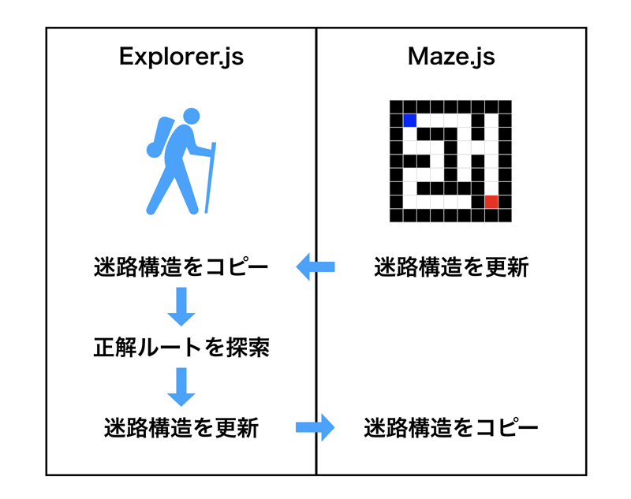
</p>

**_Explorer.js_**

```javascript
export default class Explorer {
  // mazeの情報からexplorerを生成する
  // ObjectはDeepCopyする
  constructor(WIDTH, HEIGHT) {
    this.WIDTH = WIDTH;
    this.HEIGHT = HEIGHT;
    this.grid = []; // cellTypeを格納した二次元配列
    this.start = []; // スタート地点の[row, column]
    this.beforeGoal = []; // ゴール手前の[row, column]
    this.cellType = {
      Start: 'S',
      Goal: 'G',
      Path: 0,
      Wall: 1,
      AnswerRoute: 'A',
      FromUp: 'U',
      FromRight: 'R',
      FromDown: 'D',
      FromLeft: 'L'
    };
  }
}
```

### `👍Explorerの迷路構造は、Mazeの迷路構造をディープコピーする`

上記のフロー図で**迷路構造をコピー**とありますが、ここで注意すべきはシャローコピーではなくディープコピーをするという点です。
迷路構造は二次元配列なので、シャローコピーしてしまうと Explorer インスタンス の変更が Maze インスタンス に影響を与えてしまいます。
下記に、それぞれの例を示します。

**シャローコピーの例**

```javascript
let a = [[1, 1], 2, 3];
let b = Array.from(a);

console.log(a); // => [[1, 1], 2, 3]
console.log(b); // => [[1, 1], 2, 3]
console.log(a === b); // => false

b[0][1] = 'X';
b[2] = 'X';

console.log(a); // => [[ 1, 'X'], 2, 3]
console.log(b); // => [[ 1, 'X'], 2, 'X']
```

**ディープコピーの例**

```javascript
let a = [[1, 1], 2, 3];
let b = JSON.parse(JSON.stringify(a));

console.log(a); // => [[1, 1], 2, 3]
console.log(b); // => [[1, 1], 2, 3]

b[0][1] = 'X';
b[2] = 'X';

console.log(a); // => [[1, 1], 2, 3]
console.log(b); // => [[1, 'X'], 2, 'X']
```

これから迷路の自動探索をするメソッドを実装していきますが、Explorer メソッドで変更するのは、Explorer プロパティです。
Explorer プロパティをディープコピーで定義することで、Maze プロパティに影響を与えないようにします。

**_Explorer.js_**

```javascript
deepCopyMaze(grid, start, goal) {
  // 二次元配列のDeepCopy
  this.grid = JSON.parse(JSON.stringify(grid));
  $.extend(this.start, start);
}
```

Explorer クラスのインスタンスを生成し、インスタンスメソッドを **_main.js_** で実行します。

**_main.js_**

```javascript
import Explorer from './Explorer.js';

const explorer = new Explorer(maze.WIDTH, maze.HEIGHT);
explorer.deepCopyMaze(maze.grid, maze.start);
console.log('explorer:', explorer);
```

コンソールで出力して確認すると、迷路構造をコピーできていることがわかります。

<p align="center">
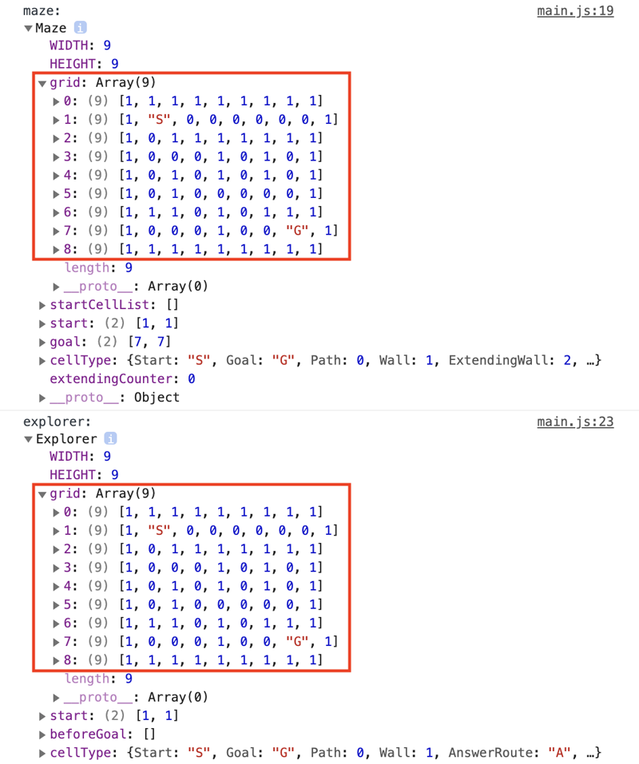
</p>

### `🧩アルゴリズム： 幅優先探索`

ここまでの実装で、迷路の情報を持った Explorer インスタンスを生成することができました。
次に、迷路の自動探索アルゴリズムを実装していきましょう。
Explorer インスタンスのメソッドを実行して、プロパティを更新していきます。

迷路を自動で探索するアルゴリズムはいくつかあるようなのですが、今回は「幅優先探索」を採用します。
幅優先探索で正解ルートを探索する処理のフローは、下記の通りです。

**幅優先探索のフロー**

1. 根ノード(スタート地点)を探索キューに追加
2. 探索キューからセルを取り出す
3. 取り出したセルのゴール判定
   - ゴールの場合、**処理を終了**
4. **隣接セル探索**の実行
5. 探索したセルを探索キューに追加
6. 探索キューが空かどうかを確認
   - 空ではない場合、**2 の処理へ**
   - 空の場合、**処理を終了**

<p align="center">
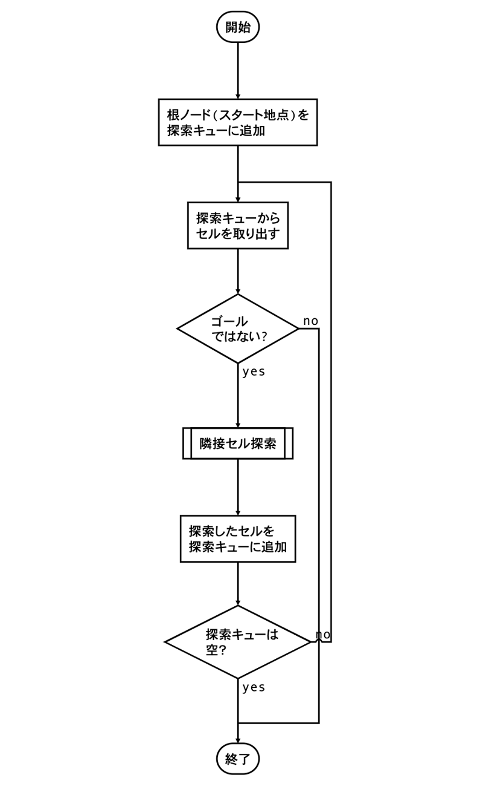
</p>

**隣接セル探索のフロー**

1. 現在地の隣接セルが、通路もしくはゴールかどうか確認
   - 通路の場合、**2 の処理へ**
   - ゴールの場合、**5 の処理へ**
   - どちらでもない場合、**4 の処理へ**
2. 探索済の印(どの方向から来たのかを示す)をつける
3. 対象の隣接セルを探索済リストに追加
4. 4 方向全て探索完了したか
   - 未完了の場合、**1 の処理へ**
   - 完了した場合、**7 の処理へ**
5. 現在地をゴール手前のセルとして更新
6. 対象の隣接セルを探索済リストに追加
7. **探索済リストをリターン**

<p align="center">
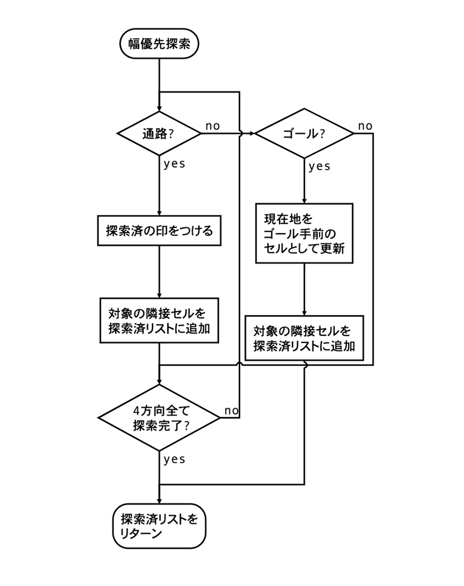
</p>
